# First Test

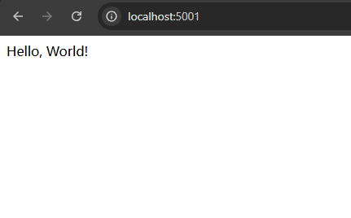
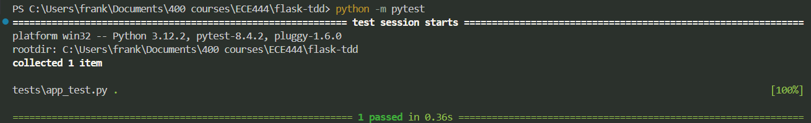

# Database Setup

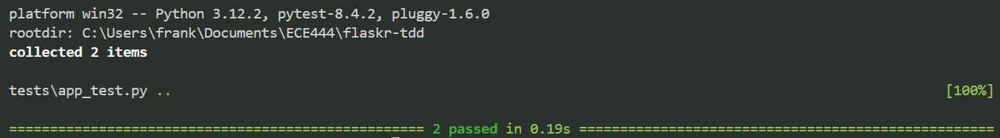

# User Login and Logout

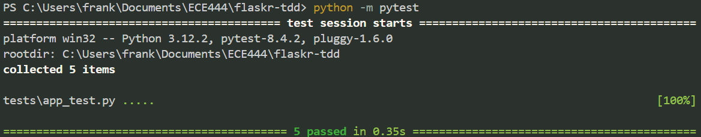

# JavaScript

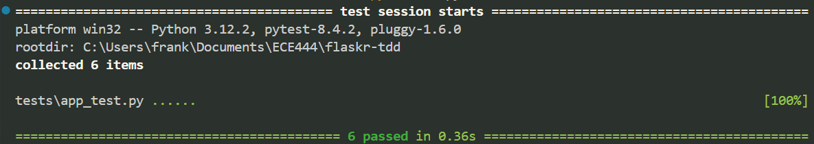

# Deployment

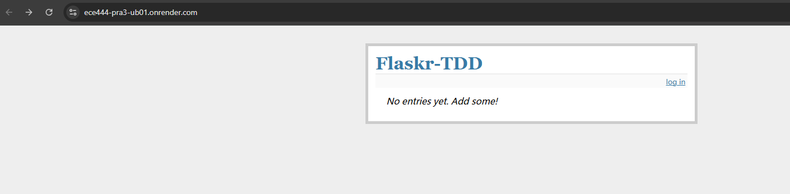
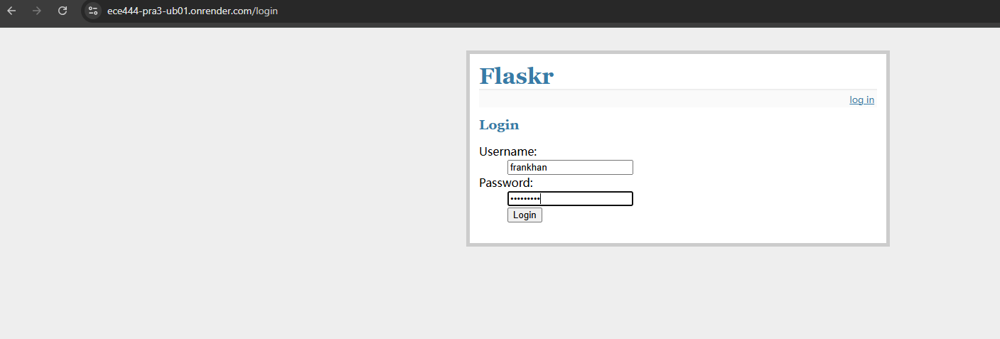
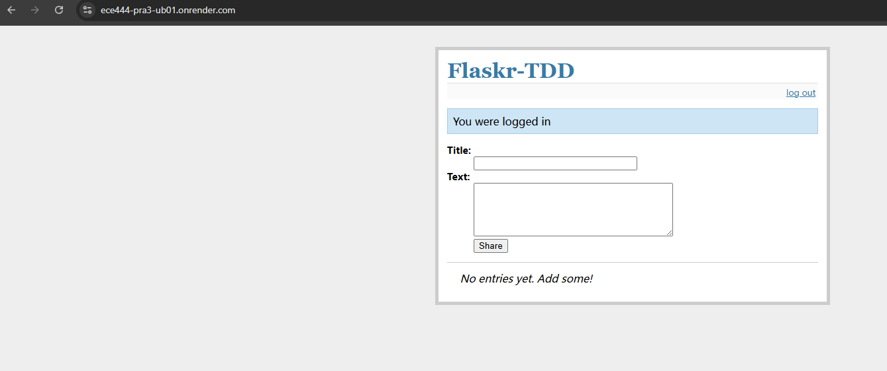
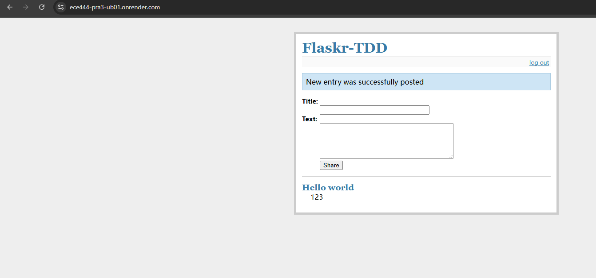

# Bootstrap

(make sure to run 'python', and then 'from app import init_db', and then 'init_db()' from project folder)

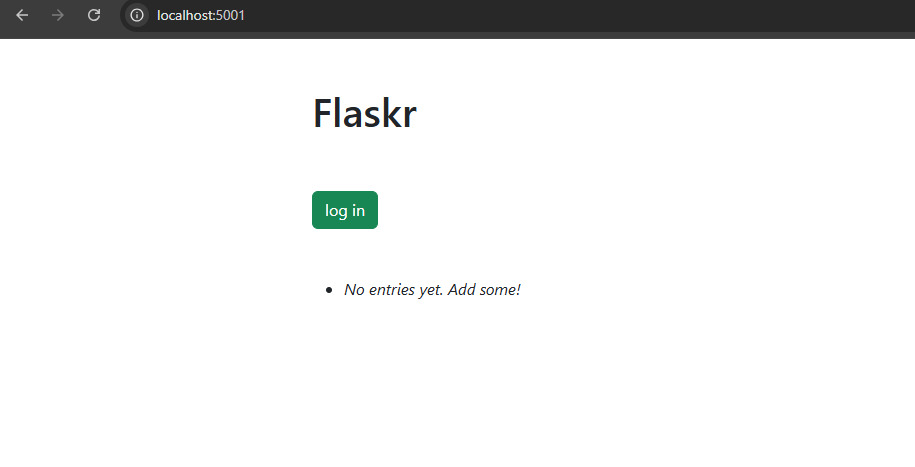
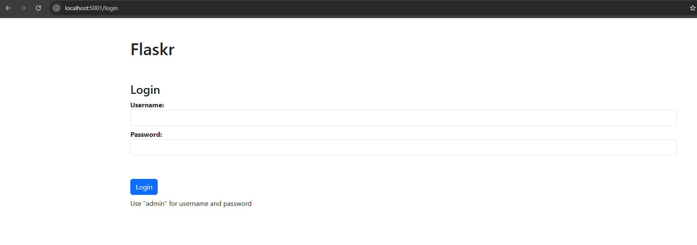
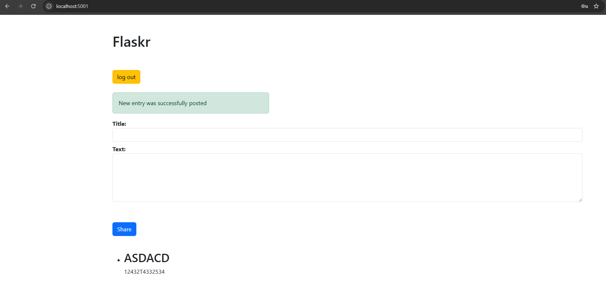

# SQLAlchemy

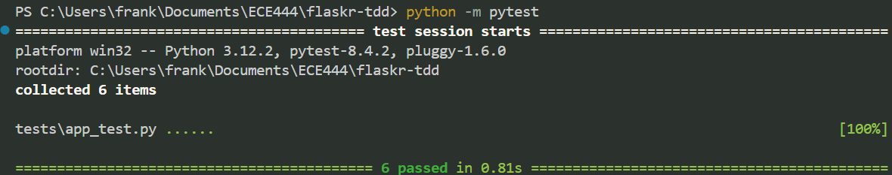

# Search Page

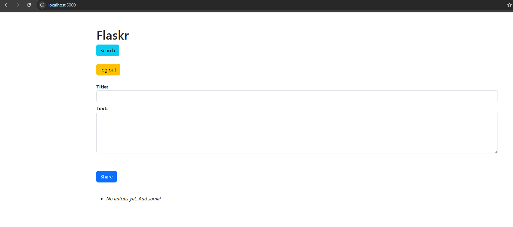
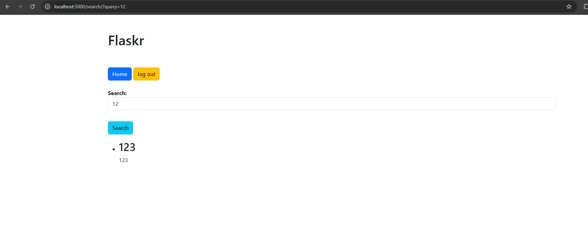

(under flaskr-tdd, run 'python -m project.app' after running 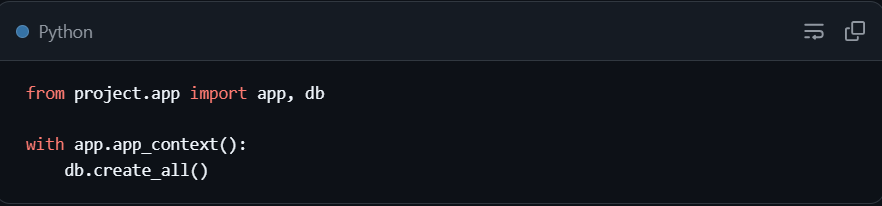 in shell. 
make sure with the two-liner, indent second line and press enter)